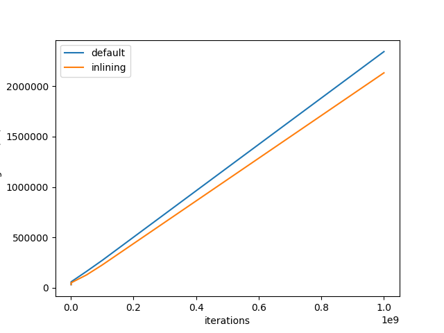
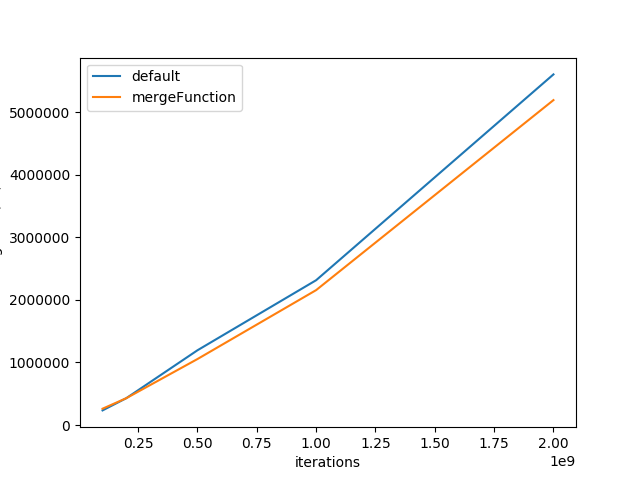

# Report for optimization results
In this report, we will take inlining and unrolling as examples to explore the optimization effects of our compiler(all other optimizations are closed).


# Modified compiler usage
Now `-O` option has to match a 3-bit string.
The bits denotes 3 types of optimizations we used in this experiment:
```
O3 function-inlining   function-merge
```
For example `-O 001` means only inlining is enabled.


# O3(1xx)
To mention that if we enable O3 for our program, we can get a boost of speed up(~4x) but the compilation time is also extended largely(~60x).

# Inlining(010)
## sample input program
```
    def void increase(ref int $a){
        $a = $a + 1;
    }

    def int run(){
      int $a = 1;
      while($a < N){
        increase($a);
      }
      return 0;
    }
```
## compiler-time peroformance
(Note: to get rid of randomness, all timings used in this report are averaged from 5 runnings.)
The compiler time changes from 227us to 489us.
When looking at the IR code, we can find the size of `increase` is almost the same as `run`. So to inline the increase function, the inlining pass actually modifies the IR a lot.
## run-time performance
We change the iteration limits and draw a iter-timing graph shown in below: 

When iteration time is large, inlined version can gain a speed up about 10~15%. However when iteration number is really small, the inlined version loose its advantage due to the overhead at function(`run`) initialization.

# mergeFunctions(001)
When some identical instruction appears in compiler, we can merge them to one function and avoid unneccessary computations.
## sample input program
```
def int run(){
  int $a = 1;
  int $b = 2;
  int $c = 3;
  int $d = 4;
  while($a < N){
    $d = $b + $c;
    $d = $b + $c;
    $a = $a + 1;
  }
  return 0;
}
```
## compiler-time peroformance
The compiler time changes from 224us to 331us.
Compared to inlining, mergeFunction modifies the IR less and do not enlarge IR.
## run-time performance
Also, we change the iteration times for while loop.

Since we have 2 identical add instructions but not 2 large functions, the merge over head seems very large, but at least we can still observe some speed up for this experiments.